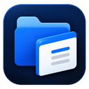
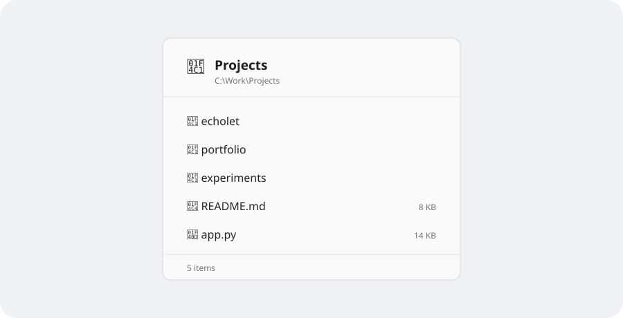

<div align="center">
  
  <h1>FolderGlimpse</h1>
  <p><strong>Hover over a folder. See what's inside.</strong></p>
  <p>A fast, lightweight File Explorer companion for Windows 11.</p>

  [](https://www.microsoft.com/windows/windows-11)
  [](https://dotnet.microsoft.com/)
  [](https://github.com/abdullah270602/folder-glimpse/releases/latest)

  <br>

  **[Download the latest FolderGlimpse beta](https://github.com/abdullah270602/folder-glimpse/releases)**
  · [View releases](https://github.com/abdullah270602/folder-glimpse/releases)
  · [Report an issue](https://github.com/abdullah270602/folder-glimpse/issues)
</div>

---

> [!IMPORTANT]
> The current public beta channel is intentionally **unsigned** while FolderGlimpse awaits approval
> for trusted open-source signing. Windows SmartScreen may show an unrecognized-app warning.
> Download only from this repository's [Releases](https://github.com/abdullah270602/folder-glimpse/releases),
> verify the checksum or GitHub attestation, and never disable SmartScreen or install a root
> certificate for FolderGlimpse.

FolderGlimpse shows a compact preview when you rest the pointer over a folder in File
Explorer—without opening it or leaving the folder you are viewing. Choose any-folder hover,
selected-folder hover, or an optional Ctrl/Shift hover modifier. Prefer the keyboard? Configure
<kbd>Space</kbd> or <kbd>Ctrl</kbd>+<kbd>Space</kbd> with tap and hold behavior. Optional exact
mouse shortcuts can open a sticky glimpse with middle-click, Ctrl+left-click, or Ctrl+right-click.



## Highlights

- **Hover to glimpse** folders directly from Windows 11 File Explorer
- **Flexible trigger options** with hover, keyboard, and opt-in exact mouse shortcuts
- **Configurable keyboard access** using Space or Ctrl+Space with tap and hold behavior
- **Open files and folders** directly from an interactive sticky preview
- **Multi-select and context actions** with familiar Windows interactions
- **System, light, and dark themes** with mixed-DPI monitor support
- **Customizable popup layouts** with Full, Compact, or Hidden headers; Smart or Hidden footers;
  optional item icons; 5/8/10/15/Auto rows; and preferred placement
- **Compact control center** for settings, help, startup behavior, and app status
- **Consistent Windows 11 styling** with purpose-built application and tray icons
- **Quiet tray operation** with centered actions, enable/disable, settings, startup, and exit
- **Local and private**: no account, cloud service, analytics, or telemetry

## Download and install

FolderGlimpse is currently distributed as a portable, self-contained Windows x64 app. It does
not require a separate .NET installation, administrator access, or a setup wizard.

1. Open the official **[Releases](https://github.com/abdullah270602/folder-glimpse/releases)** page.
2. Download `FolderGlimpse-win-x64.zip` from the newest beta release.
3. Extract the ZIP and move `FolderGlimpse.exe` to a permanent folder such as
   `%LOCALAPPDATA%\Programs\FolderGlimpse`.
4. Run `FolderGlimpse.exe` and complete the short first-run introduction.
5. Optionally enable **Launch at startup** after the EXE is in its permanent location.

The separately listed `FolderGlimpse.exe` is the same application offered as a direct download.
The ZIP is recommended because it gives most users one unambiguous asset to download and extract.
`SHA256SUMS.txt` and `FolderGlimpse.spdx.json` are verification metadata, not installers.

> [!NOTE]
> Public beta builds are not Authenticode-signed yet. Windows SmartScreen may show an
> “unrecognized app” message on first launch. A self-signed certificate would not establish public
> Windows trust, so beta releases remain transparently unsigned until trusted signing is available.

### Verify a download

Each public release includes `SHA256SUMS.txt`. From the folder containing the
download, compare the published hash with the locally calculated value:

```powershell
Get-FileHash .\FolderGlimpse.exe -Algorithm SHA256
Get-Content .\SHA256SUMS.txt
```

GitHub also records build provenance for the final EXE and ZIP. With GitHub CLI installed:

```powershell
gh attestation verify .\FolderGlimpse.exe --repo abdullah270602/folder-glimpse
gh attestation verify .\FolderGlimpse-win-x64.zip --repo abdullah270602/folder-glimpse
```

Checksums and attestations prove integrity and build origin; they do not create a Windows-trusted
publisher identity. The release page will explicitly say when trusted Authenticode signing becomes
available.

Once production signing is enabled, verify both the publisher signature and timestamp:

```powershell
$signature = Get-AuthenticodeSignature .\FolderGlimpse.exe
$signature | Format-List Status, StatusMessage
$signature.SignerCertificate | Format-List Subject, Thumbprint, NotAfter
$signature.TimeStamperCertificate | Format-List Subject, NotAfter
```

Only a `Valid` status from an official release is acceptable. Signing proves publisher
identity and file integrity; it does not guarantee that Microsoft SmartScreen will never
warn, because reputation is evaluated separately.

### Updating

Download the newest x64 ZIP from [Releases](https://github.com/abdullah270602/folder-glimpse/releases),
exit FolderGlimpse from the tray, and replace the previous EXE with the extracted newer one.

### Uninstalling

1. Right-click the tray icon and choose **Exit**.
2. Disable **Launch at startup** first if it is enabled.
3. Delete `FolderGlimpse.exe`.
4. Optional: delete `%LOCALAPPDATA%\FolderGlimpse` to remove saved preferences.

## How to use

### Hover to glimpse

1. Rest the pointer over a normal local folder in Windows 11 File Explorer.
2. After the configured delay, the glimpse appears without changing your selection.
3. Move into the glimpse to keep it visible while reading; move away to dismiss it.

**Any folder** hover is enabled by default. In **Settings → Hover preview**, choose
**Selected folder** to limit hover to the current selection, or **Off** to disable pointer
previews. You can also require <kbd>Ctrl</kbd> or <kbd>Shift</kbd> while hovering and adjust the
open delay, exit grace, and movement tolerance.

### Optional mouse shortcuts

In **Settings → Mouse shortcuts**, you can enable middle-click,
<kbd>Ctrl</kbd>+left-click, or <kbd>Ctrl</kbd>+right-click for folders. These shortcuts are off by
default. FolderGlimpse consumes only an enabled exact gesture over a recently verified local folder;
ordinary clicks, files, blank space, stale targets, injected input, and uncertain Explorer contexts
continue to Windows normally.

### Keyboard trigger

Keyboard access remains available alongside hover. Select one normal local folder, then tap the
configured <kbd>Space</kbd> or <kbd>Ctrl</kbd>+<kbd>Space</kbd> shortcut to keep a glimpse open,
or hold it for a momentary look. Tap the shortcut again or press <kbd>Esc</kbd> to close a sticky
glimpse. The shortcut and tap/hold behavior can be changed in Settings.

Hover glimpses stay non-activating until you deliberately interact with them. Click an item once
to pin the existing glimpse and make it interactive, or double-click an item to open it. The
configured keyboard trigger remains another way to open a sticky glimpse directly.

In an interactive sticky preview:

- Click to select an item.
- Double-click a file to open it in its normal Windows app.
- Double-click a folder to open it in File Explorer.
- Use <kbd>Ctrl</kbd> or <kbd>Shift</kbd> for multiple selection.
- Press <kbd>Enter</kbd> to open selected items.
- Right-click for safe actions such as Open, Copy path, Open file location, and Properties.

### Customize the popup

Open **Settings → Popup layout** to control how much chrome and metadata the glimpse uses.
Choose **Minimal**, **Balanced**, or **Detailed** as a starting point, then adjust individual
options. Header and footer can be hidden independently, item icons can be disabled (which also
skips their shell-loading work), and the list can show 5, 8, 10, 15, or an automatic number of
rows. Preferred placement supports Auto, Right, Left, Below, and Above, with safe fallback when
the chosen side has insufficient space.

Read errors always remain visible in the popup body, even in a Minimal layout. Existing users keep
the original Full-header, Always-footer appearance unless they change these options.

Closing the control-center window does not exit FolderGlimpse; it continues running in
the notification area. The tray menu provides **Open FolderGlimpse**, **Enabled**, **Settings…**,
**Launch at startup**, and **Exit**. To stop the app completely, choose **Exit**.

The About page has a manual **Check for updates** action. It reads published release metadata from
the official GitHub repository and, when a newer version exists, opens its release page for you.
FolderGlimpse never silently downloads, replaces, or runs an unsigned update.
The adjacent **Copy diagnostics** action creates a compact support summary of the version, runtime,
architecture, and relevant settings; it intentionally excludes file paths and user identity.

## Safety and privacy

FolderGlimpse works offline, requires no administrator privileges, performs no telemetry,
and does not modify previewed folders. Its hover, keyboard, and optional mouse triggers use
conservative Explorer and UI Automation checks. Uncertain targets are ignored, and input passes
through whenever the context cannot be proven safe—for example, while typing in search, the
address bar, or a rename field.

No network request is made during normal preview use. The only in-app network action is the manual
update check described above.

Settings and application state are stored locally under `%LOCALAPPDATA%\FolderGlimpse`.

## Compatibility and current limitations

- Windows 11 x64 is the supported target.
- V1 previews ordinary local filesystem folders only.
- Network/UNC folders, ZIPs, Libraries, This PC, Recycle Bin, and other virtual Shell
  locations are intentionally not supported yet.
- Elevated Explorer windows may not be accessible to a normally launched FolderGlimpse;
  the shortcut passes through safely in that case.
- Momentary previews are view-only. Hover previews support pointer double-click activation, while
  sticky previews add selection, keyboard navigation, and context actions.
- High contrast does not yet have a dedicated visual theme.

## Build from source

Requirements:

- Windows 11 x64
- [.NET 8 SDK](https://dotnet.microsoft.com/download/dotnet/8.0)
- Git

```powershell
git clone https://github.com/abdullah270602/folder-glimpse.git
cd folder-glimpse
dotnet restore FolderGlimpse.sln --configfile NuGet.config
dotnet build FolderGlimpse.sln -c Release
dotnet run --project tests/FolderGlimpse.Tests/FolderGlimpse.Tests.csproj -c Release
dotnet run --project tests/FolderGlimpse.UiTests/FolderGlimpse.UiTests.csproj -c Release
```

Create the same self-contained single-file build used for releases:

```powershell
dotnet publish src/FolderGlimpse/FolderGlimpse.csproj `
  -c Release -r win-x64 --self-contained true `
  -p:PublishSingleFile=true `
  -p:IncludeNativeLibrariesForSelfExtract=true `
  -p:EnableCompressionInSingleFile=true `
  -o artifacts/FolderGlimpse-win-x64
```

The output is `artifacts/FolderGlimpse-win-x64/FolderGlimpse.exe`.

To share a private test build, zip the complete `artifacts/FolderGlimpse-win-x64` folder. With the
single-file options above, it normally contains only the portable EXE; sharing the whole folder
keeps the process unambiguous if release files are added later.

## Contributing

Bug reports, documentation corrections, and carefully scoped feature proposals are welcome.
Please read [CONTRIBUTING.md](CONTRIBUTING.md) before preparing a change. By submitting a
contribution, you agree that it will be licensed under the project's MIT License. For security issues, follow
[SECURITY.md](SECURITY.md) instead of creating a public issue.

## Project direction

The current focus is reliability, safe Explorer integration, accessibility, and a polished
Windows experience. A small official website may be added later as a clearer home for
downloads and documentation; GitHub Releases remains the source of truth for binaries.
If FolderGlimpse is useful to you, starring the repository is a welcome way to support it.

Technical details are available in [docs/architecture.md](docs/architecture.md), with the
Windows QA checklist in [docs/manual-testing.md](docs/manual-testing.md). Maintainers can
also consult the [release runbook](docs/releasing.md), [signing guide](docs/signing.md), and
[code-signing policy](docs/code-signing-policy.md), plus the [distribution roadmap](docs/distribution.md).
The manual GitHub security controls are listed in
[repository settings](docs/repository-settings.md).

## License

FolderGlimpse is open-source software licensed under the [MIT License](LICENSE).
See [licensing notes](docs/licensing.md) for the project's contribution terms.
