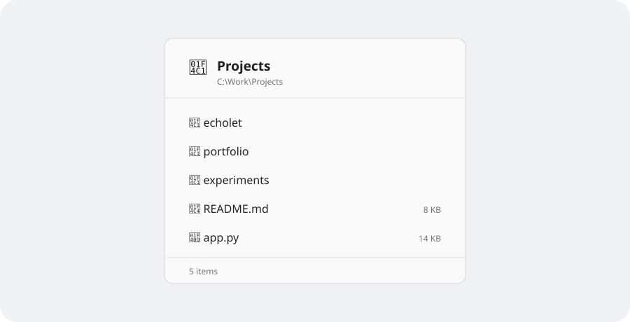

# FolderGlimpse

**Glance inside folders without opening them, and so much more.**

FolderGlimpse is a lightweight Windows utility that lets you quickly inspect the contents
of a folder directly from File Explorer without navigating into it.

Select a folder, press Space, and glimpse what's inside.



## Use it

1. Launch `FolderGlimpse.exe`. It stays in the notification area.
2. In Windows 11 File Explorer, select exactly one normal local folder in the file list.
3. Tap **Space** to open a sticky preview. Tap **Space** again or press **Escape** to close.
4. Hold **Space** for about 200 ms to open a momentary preview; release it to close.
5. In a sticky preview, click to select, double-click to open, use Ctrl/Shift for multiple
   selection, or right-click for safe Open, Copy path, location, and Properties actions.
6. Right-click the tray icon for **Settings…**, startup control, temporary disable, About, or Exit.

Settings are saved automatically in `%LOCALAPPDATA%\FolderGlimpse\settings.json`. You can
choose light/dark/system theme, popup dimensions and density, visible metadata, hidden
files, sorting, initial item limit, Space or Ctrl+Space, hold delay, tap behavior, and
launch-at-sign-in. Interaction settings control activation, multi-selection, optional
selection checkboxes, open-many confirmation, and whether the popup closes after opening.
**Reset defaults** restores the original behavior.

FolderGlimpse deliberately passes Space through when Explorer is not foreground, selection
is ambiguous, a file or multiple items are selected, a text/search/rename field is
focused, a modifier is held, or its Explorer snapshot is stale. Plain Space does have an
Explorer selection meaning, so FolderGlimpse only overrides it in the narrow eligible case.

## Build

Requirements: Windows 11 x64 and the [.NET 8 SDK](https://dotnet.microsoft.com/download/dotnet/8.0).
No third-party NuGet packages are used.

```powershell
dotnet restore FolderGlimpse.sln
dotnet build FolderGlimpse.sln -c Release
dotnet run --project tests/FolderGlimpse.Tests/FolderGlimpse.Tests.csproj -c Release
```

Create a framework-dependent build:

```powershell
dotnet publish src/FolderGlimpse/FolderGlimpse.csproj -c Release -r win-x64 --self-contained false -o artifacts/FolderGlimpse-win-x64
```

Create the preferred self-contained single-file build:

```powershell
dotnet publish src/FolderGlimpse/FolderGlimpse.csproj -c Release -r win-x64 --self-contained true -p:PublishSingleFile=true -p:IncludeNativeLibrariesForSelfExtract=true -p:EnableCompressionInSingleFile=true -o artifacts/FolderGlimpse-win-x64-self-contained
```

## Design

- .NET 8/WPF tool window with no Explorer injection; momentary mode never activates,
  while sticky interaction explicitly takes focus and returns it when dismissed
- conservative Shell automation + UI Automation Explorer snapshot worker
- dedicated `WH_KEYBOARD_LL` thread; no filesystem, COM, UIA, WPF, or blocking work in
  the hook callback
- explicit, unit-tested tap/hold state machine
- cancellable off-UI-thread folder inspection with configurable hidden-file, sort, and limit policies
- compact ten-row viewport with a rounded theme-aware scrollbar for larger folders
- native shell icons loaded after names appear, so icon extraction does not delay content
- per-monitor-V2 physical-pixel positioning and work-area clamping
- live system/light/dark theming, atomic JSON settings, and HKCU launch-at-sign-in control
- shared Fluent-inspired WPF templates for cards, buttons, toggles, dropdowns, sliders,
  and the same compact scrollbar in Settings and the preview
- a custom light/dark tray renderer with modern spacing, rounded hover states, accent
  checkmarks, and live synchronization with the selected app theme

See [the architecture decision](docs/architecture.md) and
[manual integration checklist/results](docs/manual-testing.md).

## Current limitations

- V1 supports ordinary local filesystem folders only. UNC/network paths, ZIPs, Libraries,
  This PC, Recycle Bin, and other virtual Shell namespaces are rejected.
- Explorer integration is intentionally fail-closed. An elevated Explorer window or a
  Windows build whose UI Automation tree cannot be proven safe will receive normal Space
  behavior and show no preview.
- Windows 11 tab disambiguation uses the focused UIA item name plus the matched Explorer
  frame. Two tabs under the same frame selecting same-named folders are treated as
  ambiguous and are rejected.
- Momentary previews remain deliberately view-only. Sticky previews support selection and
  activation, but do not navigate inside folders.
- **Open file location** opens the containing directory but does not yet preselect the file.
- The Properties action requests Windows' normal `properties` Shell verb; unavailable or
  unassociated handlers fail with a safe in-popup message.
- Click-away is detected through foreground/focus/selection polling; clicking the same
  already-selected row may leave a sticky preview open. Space or Escape always closes it.
- High contrast is not specially styled yet. The app follows light/dark app mode.

FolderGlimpse works offline, performs no telemetry, does not modify previewed folders, and
does not require administrator privileges.

### Diagnostics

If Explorer integration needs troubleshooting, start FolderGlimpse from PowerShell with
`--diagnostics`. It writes `%LOCALAPPDATA%\FolderGlimpse\diagnostics.log`. The additional
`--allow-injected-input` switch exists only for automated integration testing; normal
launches continue rejecting injected keyboard events.

Visual QA can render deterministic Settings and preview snapshots with
`--capture-settings=<png>`, `--capture-preview=<png> --preview-folder=<path>`, optional
`--capture-tray=<png>`, `--capture-theme=Light|Dark`, `--capture-bottom`,
`--capture-interaction`, and
`--capture-interactive` for a deterministic selected-row preview.
